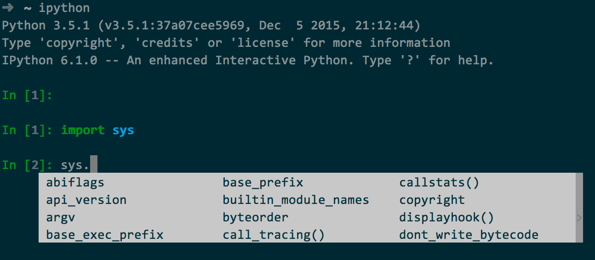

# python解释器

> 上文我们说到, Python是一门解释性的语言, 在程序执行的时候需要将代码逐行翻译成机器码; **Python解释器**的功能就是将Python程序代码翻译为机器码;  


## Python有多种解释器, 默认为CPython

| 类型 | 描述 |
| --- | --- | 
|  CPython  |   默认  |  
|  IPython  |   基于CPython的一个交互式解释器, 安装ipython之后拥有, 在交互上有所增强, 调试的时候使用ipython会事半功倍 |
|  PyPy  |   PyPy采用[JIT即时编译](https://en.wikipedia.org/wiki/Just-in-time_compilation) 技术，对Python代码进行动态编译（注意不是解释），所以可以显著提高Python代码的执行速度|
|  Jython  |  是运行在Java平台上的Python解释器, 编译成Java字节码执行  |
|  IronPython  |   是运行在微软.Net平台上的Python解释器, 编译成.Net的字节码 |

注释: JIT(动态编译)

> 先编译为字节码, **读取部分字节码**然后**动态编译**为机器码(PS: 字节码不是任何特定计算机的机器码，并且可以在计算机体系结构之间移植);

### 看一个第三方库numba实现JIT的例子

```
#!/usr/bin/env python3

import time
from numba import jit

@jit
def calc(n, i=0, cols=0, diags=0, trans=0):
    if i == n:
        return 1
    else:
        rt = 0
        for j in range(n):
            col = 1 << j
            diag = 1 << (i - j + n - 1)
            tran = 1 << (i + j)

            if (col & cols) == 0 and (diag & diags) == 0 and (tran & trans) == 0:
                rt += calc(n, i+1, cols | col, diags | diag, trans | tran)
        return rt

if __name__ == '__main__':
    t = time.time()
    print(calc(13))
    print(time.time() - t)
    
# 使用JIT和不使用速度差别是28倍左右
```

### 既然pypi比较快, 那么为什么大家都用cpython呢?

Veedrac的答复: 

>就像其他人提到的，PyPy有很弱的C 语言扩展性。它支持C语言扩展，但是比Python本身的速度还慢。因此，很多模块本身就要求使用CPython.。

>CPython 上的Numpy的数据处理性非常好，满足了那些既要求速度又大量使用Pandas, SciPy等数据分析任务的库的人。

>所以，Pypy 要么不支持或者很弱支持C语言扩展，要么减慢了那些数据处理的速度。完全无法比拟既可以满足速度要求又简单易用的CPyhon。

>第二点，Python 3的支持在现阶段还是实验期。那些使用最新版本的Python新功能的人，现在应该还不愿意扔掉那些还在新鲜期的新奇功能。

>第三点，PyPy 并不是真正的脚本快，而大多数使用Python 的人就是在用脚本。这些脚本就是一些简短的程序。 PyPy 的最大优点是它针对长时间运行的简单数字处理的即时 (JIT) 编译器。直白地说， PyPy的先编译处理时间比CPython长的多。

>第四点，惰性。转移到PyPy需要重新装备机器。这对很多用户或者使用机构来说，都是太多的额外工作了。

>第五点(PS: 个人补充), CPython的第三方库实现了JIT的功能, 在计算密集型的工作中也能加快速度;


[附上pypy的下载链接](http://pypy.org/download.html)


### python的字节码文件`.pyc`文件

简单来说，pyc文件就是Python的字节码文件, 第一次编译为字节码, 后续直接从字节码解释为机器码, 可以减少后续解释器解释Python文件的时间, 提高程序运行速度;

#### 什么时候生成pyc文件

直接执行时不会生成, 只有当成模块导入的时候才能生成;
 
## 安装IPython

```python
pip install ipython
```

> 安装完成后使用 **Tab键** 能提示方法, 这在你使用你不熟悉的模块时很有用  



