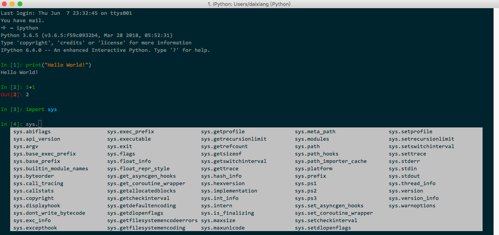

# Python交互环境

> 安装完Python之后, 我们就可以在命令行终端输入 **python 或者 ipython**进入**python交互模式**;  

## Ipython使用

### Tab键: 查看对象方法属性

> **[推荐]**使用 **ipython(交互型Python解析器)**,  它的界面更友好, Tab键能给予提示, 这样在交互环境调试代码的时候会有很大帮助;   

### dir(对象名): 查看对象方法

> Python默认交互环境下, 使用  **dir(对象名)** 也能获得对象后的方法, 只是不那么直观;  

### help(对象名): 查看对象或者方法的使用文档

> 假设你初次使用一个第三方包, 你不熟悉这个包中任何一个函数或者类的使用, 都可以通过 **help(对象)**  的方法, 查看文档;  

所以, 当你要提供自己的包给其他人使用的时候, 一定要写规范的文档, 这样其他人在使用你的程序的时候, 就能很方便的知道你的库如何使用了;

