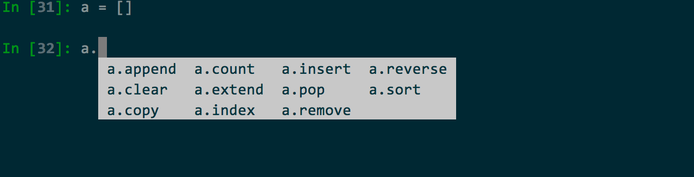

# list和tuple
#Python/语法/列表和元组

列表和元组都是可迭代对象, 区别在于tuple一经定义无法更改, 而list列表可以更改;




## 列表

## 常规操作

```python
In [37]: lis = [1, 2, 3]

In [38]: lis.append(4)

In [39]: lis
Out[39]: [1, 2, 3, 4]

In [40]: lis.insert(0, 5)

In [41]: lis
Out[41]: [5, 1, 2, 3, 4]

In [43]: help(lis.extend)

In [44]: lis2 = [6, 7, 8]

In [45]: lis.extend(lis2)

In [46]: lis
Out[46]: [5, 1, 2, 3, 4, 6, 7, 8]

In [47]: lis.pop()
Out[47]: 8

In [48]: lis
Out[48]: [5, 1, 2, 3, 4, 6, 7]

In [49]: lis.remove(3)

In [50]: lis.sort()

In [51]: lis
Out[51]: [1, 2, 4, 5, 6, 7]

In [52]: lis.reverse()

In [53]: lis
Out[53]: [7, 6, 5, 4, 2, 1]

In [56]: lis.index(1)
Out[56]: 5
In [60]: lis.count(1)
1
```

### 列表普通迭代

```python
In [35]: for i in [1, 2, 3]:
    ...:     print(i)
    ...:
1
2
3
```

### 列表带index的迭代

```python
In [36]: for index, value in enumerate([1, 2, 3]):
    ...:     print(index, value)
    ...:
0 1
1 2
2 3
```


## 列表组合为字符串

```python
In [54]: ",".join([str(i) for i in lis if i])
Out[54]: '7,6,5,4,2,1'
```


## 切片

```python
In [1]: a = range(10)

In [2]: a
Out[2]: range(0, 10)

In [3]: a[:]
Out[3]: range(0, 10)

In [4]: a[0:1]
Out[4]: range(0, 1)

In [5]: a[-1]
Out[5]: 9

In [6]: a[-1:-3]
Out[6]: range(9, 7)

In [7]: a[0:8:2]
Out[7]: range(0, 8, 2)

In [8]: [a[i] for i in a[0:8:2] if i]
Out[8]: [2, 4, 6]

In [9]:
```


