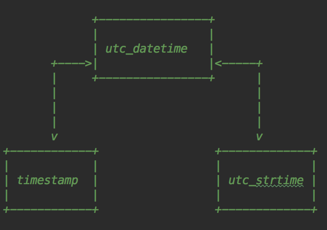
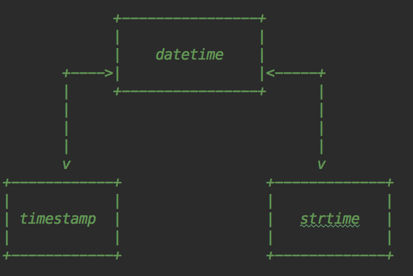

# 时间处理

## 准备工作

- 推荐使用datetime模块

### 理解: timestamp 时间戳

**timestamp是时间的一种数字表示**, 它表示的是以**1970年1月1日 00:00:00 UTC+00:00**时间为原点, 据今天过去的时间;

> 1970年1月1日 00:00:00 UTC+00:00, timestamp=0  
> 在此之前, timestamp为负浮点数, 例如: -1429417200.234234  
> 在此之后, timestamp为正浮点数, 例如: 1429417200.234234  

> 小数点前面默认10位, 单位秒, 若数据库需要存储时间精确到微秒, 那么 int(timestamp * 1000), 依此类推  

### 理解: timezone 时区

假设UTC时间为: 

	2018-06-08 00:00:00

对应的+8时区的时间为:

        2018-06-08 08:00:00 

### 通俗的解释

timestamp是**时间的一个标准**, 表示1970年**据今**过去了多少秒;

**据今**是据那个今呢?

这个 **今** 其实是 **时区的一个标准**, 指的是UTC时间;

比如我现在在中国上海(+8区), 假设现在的时间是 2018-06-08 08:00:00, 现在我们要把这个时间转为时间戳, 那么先将时间转为UTC时间 2018-06-08 00:00:00, 此时, 时间处于相同时区了, 就能计算出 **1970-01-01 00:00:00 UTC+00:00** 到 **2018-06-08 00:00:00 UTC+00:00**的时间差值, 得出了我们想要的时间戳;

所以, 在世界上任何一个时区计算时间戳得到的值都是一样的, 因为其实时间处理函数是先将 **带时区信息的时间** 转化成了 **UTC时区时间**然后进行计算的. **由于时间戳与时区无关**, 故我们存储时间的时候, 可以先转化为**timestamp格式**存储, 在程序展示的时候再转化为特定格式以及特定时区的时间;

另外, datetime.datetime.now() 默认是本地时间, 需要添加 tzinfo时区信息才能准确的表达一个时间;


## UTC时间格式互相转化




- [timestamp 和 utc_datetime]  可以直接转化
- [utc_datetime 和 utc_strftime] 可以直接转化 
- [timestamp 和 utc_strtime]  不能直接转化, 需要先转为**utc_datetime**

```python
import time
from datetime import datetime

# 获取当前timestamp
_timestamp  = time.time()

# `timestamp` 转 `utc_datetime`
utc_datetime = datetime.utcfromtimestamp(_timestamp)

# `utc_datetime` 转 `timestamp` 
_timestamp = datetime.timestamp(utc_datetime)

# `utc_datetime` 转 `utc_strftime`
utc_strftime = utc_datetime.strftime('%Y-%m-%d %H:%M:%S.%f')

# `utc_strftime` 转 `utc_datetime`
utc_datetime = datetime.strptime(utc_strftime, '%Y-%m-%d %H:%M:%S.%f')

# `timestamp` 转 `utc_strftime `
utc_strftime = datetime.utcfromtimestamp(_timestamp).strftime('%Y-%m-%d %H:%M:%S.%f')

# `utc_strftime ` 转  `timestamp` 
utc_datetime = datetime.strptime(utc_strftime, '%Y-%m-%d %H:%M:%S.%f')
_timestamp = datetime.timestamp(utc_datetime)
```


## [同理]当前时间格式互相转化




```python
import time
from datetime import datetime

# 获取当前timestamp
_timestamp  = time.time()

# `timestamp` 转 `local_datetime`
local_datetime = datetime.utcfromtimestamp(_timestamp)

# `local_datetime ` 转 `timestamp` 
_timestamp = datetime.timestamp(local_datetime)

# `local_datetime` 转 `local_strftime`
local_strftime = utc_datetime.strftime('%Y-%m-%d %H:%M:%S.%f')

# `local_strftime` 转 `local_datetime `
local_datetime = datetime.strptime(local_strftime, '%Y-%m-%d %H:%M:%S.%f')

# `timestamp` 转 `local_strftime`
local_strftime = datetime.utcfromtimestamp(_timestamp).strftime('%Y-%m-%d %H:%M:%S.%f')

# `local_strftime` 转  `timestamp` 
local_datetime = datetime.strptime(local_strftime, '%Y-%m-%d %H:%M:%S.%f')
_timestamp = datetime.timestamp(local_datetime)
```


## 本地时间和UTC时间互转

```python
from datetime import datetime, timedelta, timezone
now = datetime.now()

# 方法1: now.replace
now_tz = now.replace(tzinfo=timezone(timedelta(hours=8)))

# 方法2: now.astimezone
now_tz = now.astimezone(timezone(timedelta(hours=8)))
```

```shell
# 输出
In [55]: now_tz
Out[55]: datetime.datetime(2018, 6, 8, 14, 40, 53, 182324, tzinfo=datetime.timezone(datetime.timedelta(0, 28800)))
```


## datetime加减

```python
In [56]: from datetime import datetime, timedelta

In [57]: now = datetime.now()

In [58]: now
Out[58]: datetime.datetime(2018, 6, 8, 14, 48, 8, 744201)

In [59]: now + timedelta(hours=8)
Out[59]: datetime.datetime(2018, 6, 8, 22, 48, 8, 744201)

In [60]: now - timedelta(days=1)
Out[60]: datetime.datetime(2018, 6, 7, 14, 48, 8, 744201)

In [61]: now + timedelta(days=2, hours=12)
Out[61]: datetime.datetime(2018, 6, 11, 2, 48, 8, 744201)
```


